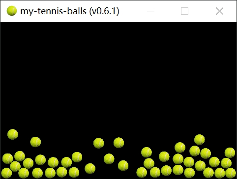

#+TITLE: my-tennis-balls
#+STARTUP: overview num indent
#+OPTIONS: ^:nil

* 项目截图

* 快速开始
** 项目介绍
本项目由 [[https://github.com/Jeanhwea/cocos2d-x-v3][cocos2d-x-v3]] 脚手架生成，创建命令
#+BEGIN_SRC sh
  cocos new -l cpp -p io.github.jeanhwea.cocos2dx.my-tennis-balls my-tennis-balls
#+END_SRC

** Windows 开发
生成项目解决方案文件 *.sln
#+BEGIN_SRC sh
  cmake -B build -G"Visual Studio 17 2022" -A win32
#+END_SRC

构建项目
#+BEGIN_SRC sh
  cmake --build build
#+END_SRC

** MacOS 开发
#+BEGIN_SRC sh
  cmake -B build -G"Xcode"
#+END_SRC

构建项目
#+BEGIN_SRC sh
  cmake --build build --config Release
#+END_SRC
